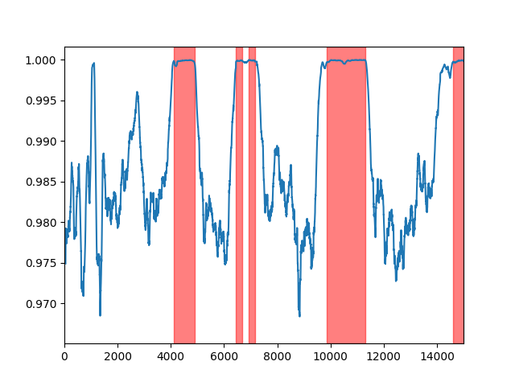

# TrafficWaitDetector

## Summary
This project leverages a  approach to identify low activity segments in driving videos using a combination of frame embeddings and pairwise similarity calculations. The method involves the following steps:

### 1. Frame Embedding Extraction:

Each frame of the video is processed using a pre-trained CLIP model (ViT-B-32-quickgelu) to generate high-dimensional embeddings that capture the semantic content of the frame.
These embeddings are normalized to unit length.

### 2. Pairwise Similarity Calculation:

The cosine similarity between consecutive frame embeddings is calculated. Specifically, similarities are computed for pairs of frames such as (frame1, frame2), (frame2, frame3), etc.
These similarity scores provide a measure of how much each frame differs from the next, with higher scores indicating more similar frames.



### 3. Identification of Low Activity Segments:

The standard deviation of the similarity scores is computed over a rolling window.
A threshold is set based on the lower quantile (e.g., 10th percentile) of the rolling standard deviation to identify periods of low activity (where the vehicle is likely waiting in traffic).
Binary closing is applied to smooth the identified low activity segments, filling in small gaps.


### 4. Segment Extraction:

Segments of low activity are extracted from the video, defined by the start and length of each identified period.
Each segment is saved as a separate video file. Optionally, the segments can be converted to the x264 codec for better compatibility and visualization.
By utilizing frame embeddings and pairwise similarity calculations, this approach effectively identifies periods in the video where there is little to no movement, such as when a vehicle is stopped at a traffic light. This method provides a robust way to automatically detect and extract these segments, which can be useful for various applications such as traffic analysis and driving behavior studies.


## Result 

i used following video on youtube
[sample video](https://www.youtube.com/watch?v=69cVF_bj_Qs)


extracted segments are 
```
00:02:16 - 00:02:42
00:03:34 - 00:03:42
00:03:50 - 00:03:58
00:05:28 - 00:06:17
00:08:06 - 00:08:29
00:08:45 - 00:08:51
00:09:14 - 00:09:18
00:09:42 - 00:09:55
00:11:47 - 00:11:53
00:12:01 - 00:12:25
00:13:11 - 00:13:18
00:13:26 - 00:13:34
00:14:30 - 00:14:43
00:16:28 - 00:17:10
00:18:31 - 00:18:38
00:18:52 - 00:18:59
00:22:36 - 00:22:53
00:27:40 - 00:28:02
00:32:08 - 00:32:34
00:33:26 - 00:33:50
00:33:59 - 00:34:17
00:36:36 - 00:36:41
00:36:49 - 00:36:56
00:39:08 - 00:39:16
00:39:34 - 00:39:53
00:41:07 - 00:41:16
00:43:04 - 00:43:09
00:43:24 - 00:44:02
00:45:05 - 00:46:22
```

you can visually verify it
(currently it partition single traffic wait to multiple one)

you might add heuristic such as 
`if two traffic wait is within 1 minute, combine them`


## download data

you dont need high resolution video to run this. simply download 480p with following command

```bash
yt-dlp -f 'bestvideo[height=480]' 'https://www.youtube.com/watch?v=69cVF_bj_Qs' -o driving-480p.mp4
```


## Installation

using conda,
```bash
conda env list | grep $PWD/venv || conda create --prefix $PWD/venv python=3.11 pip ipykernel -y
conda activate $PWD/venv
pip install -r requirements.txt
```

i'm quite sure you can use current environment. simply run,
```bash
pip install -r requirements.txt
```


## Run
you can run it interactively in vscode or simply run
```bash
python find-plateau.py
```


### Adjustable Parameters

1. **Window Size**: `window = fps * 3`
   - This controls the size of the rolling window used to calculate the standard deviation of frame similarity scores. Increasing the window size will smooth out the standard deviation curve, potentially ignoring smaller low activity segments.

3. **Threshold**: `threshold = ser_std.quantile(0.1)`
   - This sets the threshold for identifying low activity segments. The default value is the 10th percentile of the rolling standard deviation. Increasing this threshold will increase the recall, potentially identifying more low activity segments.


## references
[embedding model](https://github.com/mlfoundations/open_clip)


## code explanation

for grouping low activity region, i used 
```python
for group, gdf in signal[signal==True].groupby( (signal==False).cumsum()):
    start = gdf.index[0]
    length = len(gdf)
    if length > 90:
        segments.append((start, length))
```

you can simply check what its doing by inspect following example

```python
import pandas as pd

# Example time series data
ts = [False, True, True, False, True, False, False, True, True, True, False]

signal = pd.Series(ts)
grouped_true_segments = signal[signal == True].groupby((signal == False).cumsum())

# Let's print out the groups
for name, group in grouped_true_segments:
    start = group.index[0]
    length = len(group)
    print(f"Group {name=} {start=} {length=}")
```

if you run code, it show
```
Group name=1 start=1 length=2
Group name=2 start=4 length=1
Group name=4 start=7 length=3
```

